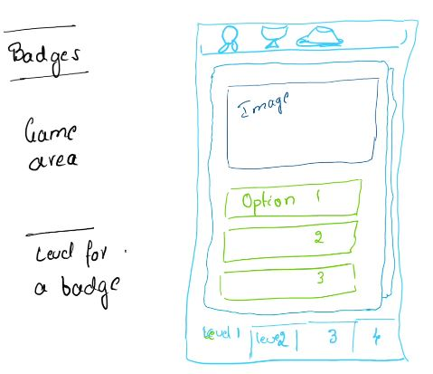

# UI UX Design

## Initial concept

### Single word

The single word game level to have fun with name of the object, name of the actions with the support of image.

Layout:

Potential Resources: https://in.pinterest.com/sanskritvarta/_created/ (https://pin.it/3x58PxP)

| Badge | level | Image | Question in sanskrit | Question in English | Answer options (max 3) | Score for each answers |
| --- | --- | --- | --- | --- | --- | --- |
| Student/silver | 1 | apple.jpg | I eat ... | I eat .... | Apple, mango, grapes | 100%, 50% 10% |
| Student/silver | 1 | Mango.jpg | I eat ... | I eat .... | Apple, mango, grapes | 50%, 100% 10% |
| Student/silver | 1 | Graphs.jpg | I eat ... | I eat .... | Apple, mango, grapes | 10%, 10% 100% |
